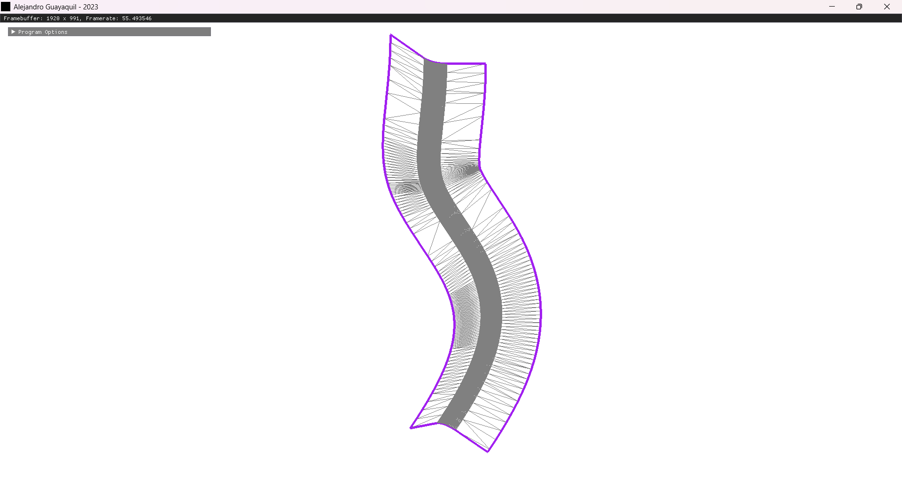
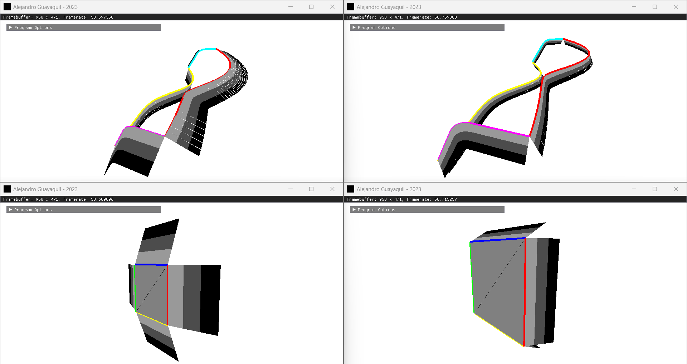
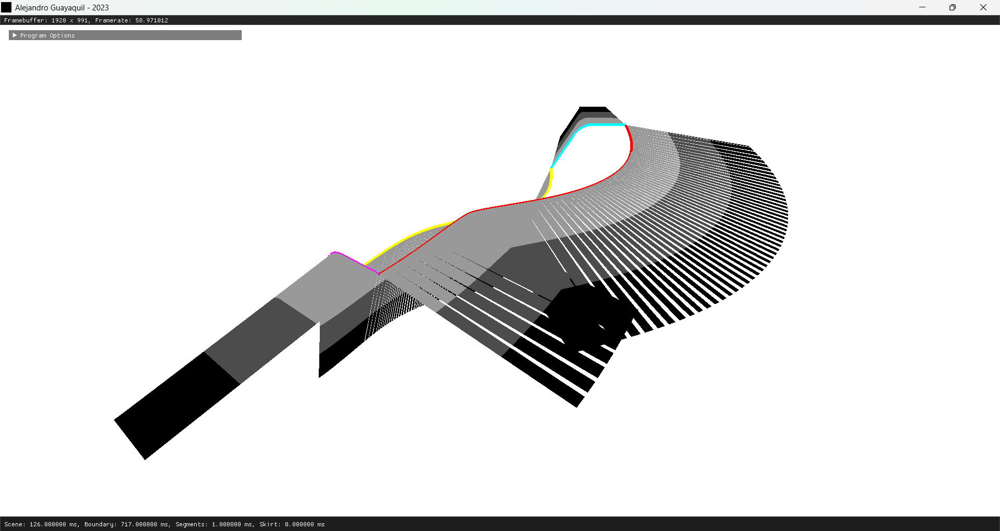

# Document Scope
The following are the steps I followed to solve the addition of a "skirt" for a STL file format. The program is interactive and a tipycal instance would look like this image
<p align="center"></p>

Above image is showing a skirt generated for a simple STL file that represents a plane. The skirt has a 45 degrees angle and 10 levels of discretization

#### Development Environment
<details><summary>Show Content</summary>
I decided to use the following technologies to do the solution

1. **Microsoft Visual Studio 2019 with C++14 Standard :** To use the Standard Template Library
2. **CMake 3.0 or higher :** To have a crossplatform solution
3. **Open-Asset-Importer -Library (Assimp) :** To import | export a STL file 
4. **GLFW :** To create an OS window
5. **OpenGL Mathematics (GLM) :** To do math with vectors and matrices
6. **Dear ImGui :** To create a Graphical User Interface 
</details>

#### Open a STL file
<details><summary>Show Content</summary>
Initially one should take a look at how the geometry looks. For that you can use any software that is over the internet that supports STL file format (some examples are MeshLab or Blender)

That sounds easy but given that I will have to do things in code let me show you how to use the library Assimp (based https://learnopengl.com/Model-Loading/Model) for the purpose of loading a STL file

I created 2 classes, `Mesh` and `CADModel`. A `Mesh` contains the geometry and connectivity while a `CADModel` is a composition of meshes. Here is how the interface looks for each class
<details><summary> Show Code </summary>

```Cpp
struct Vertex
{
	glm::vec3 position;
	glm::vec3 normal;
};
class Mesh
{
public:
	Mesh(const std::vector<Vertex> &, const std::vector<unsigned int> &);
	const std::vector<unsigned int> & getIndices() const;
	const std::vector<Vertex> & getVertices() const;
private:
	std::vector<unsigned int> indices;
	std::vector<Vertex> vertices;
};
class CADModel
{
public:
	void load(const std::string &);
	const Mesh & getMesh(unsigned int) const;
	unsigned int getNumberOfMeshes() const;
	glm::vec3 getCenter();
	float getScaleFactor();
private:
	Mesh processsMesh(aiMesh *);
	void processNode(aiNode *, const aiScene *);
	std::vector<Mesh> meshes;
	glm::vec3 center;
	float scaleFactor;
};
```
</details>

Notice how the structure `Vertex` has a **position** and a **normal**. Also, the class `CADModel` has the methods `getCenter()` and `getScaleFactor()` which returns `center` and `scaleFactor` variables respectively. Those values are computed at the end of this section.

The `load` method does the work of grabbing the data from our STL file. It returns an object of the type `const aiScene *` that has the description of the part, i.e.

1. How many meshes does the part has
2. For each mesh what is the relation between the vertices and connectivity indices, a.k.a topology

The scene needs to be plug-in with the `processNode()` method which is the one responsible for using `processMesh()` to collect the geometrical information. The implementation for all those methods looks like
<details><summary> Show Code </summary>

```Cpp
inline glm::vec3 AssimpVec3ToglmVec3(const aiVector3D & v)
{
	return glm::vec3(v.x, v.y, v.z);
}
Mesh CADModel::processsMesh(aiMesh * mesh)
{
	std::vector<Vertex> vertices(mesh->mNumVertices);
	for (unsigned int i = 0; i < mesh->mNumVertices; i++)
	{
		Vertex vertex;
		vertex.position = AssimpVec3ToglmVec3(mesh->mVertices[i]);
		vertex.normal = AssimpVec3ToglmVec3(mesh->mNormals[i]);
		vertex.normal = glm::normalize(vertex.normal);
		vertices[i] = vertex;
	}
	size_t numberOfIndices = ((size_t)mesh->mNumFaces * 3);
	std::vector<unsigned int> indices(numberOfIndices);
	for (size_t i = 0; i < mesh->mNumFaces; i++)
	{
		auto face = mesh->mFaces[i];
		auto faceIndex = (3 * i);
		indices[faceIndex + 0] = face.mIndices[0];
		indices[faceIndex + 1] = face.mIndices[1];
		indices[faceIndex + 2] = face.mIndices[2];
	}
	return Mesh(vertices, indices);
}
void CADModel::processNode(aiNode * node, const aiScene * scene)
{
	for (unsigned int i = 0; i < node->mNumMeshes; i++)
	{
		auto mesh = scene->mMeshes[node->mMeshes[i]];
		meshes.push_back(processsMesh(mesh));
	}
	for (unsigned int i = 0; i < node->mNumChildren; i++)
	{
		processNode(node->mChildren[i], scene);
	}
}
void CADModel::load(const std::string & filename)
{
	Assimp::Importer importer;
	auto processingFlags = (aiProcess_JoinIdenticalVertices | aiProcess_Triangulate);
	auto scene = importer.ReadFile(filename.c_str(), processingFlags);
	if (!scene)
	{
		printf("Error loading file %s\n", filename.c_str());
		return;
	}
	meshes.clear();
	processNode(scene->mRootNode, scene);
}
```
</details>

And voila, that will be the code to load an STL file (in practice any other format of a 3D model like OBJ, FBX, etc.). It is worth noticing that

1. When fetching the normal of a vertex we are normalizing it via `glm::normalize()`. For just loading the geometry that is irrelevant but I need those normals to be unit length for a later section so better to do it as soon as possible.
2. The collection of connectivity is supposing to have **triangular face** since it is collecting 3 indices per face. This could be not entirely true but Assimp tries to *protect* such via the flag `aiProcess_Triangulate`. I could also write code there to decide what happens if a face has more than 3 indices (like a quad for example) but that is out of the scope of the task.

Everything good but how do I know the dimensions of the object? Well, a common way to solve such is to find the **axis aligned bounding box**. For such, the implementation is simple, just traverse all vertices and keep the max and min in each direction
<details><summary> Show Code </summary>

```Cpp
void checkMinMaxVertexPosition(const Vertex & vertex, glm::vec3 & min, glm::vec3 & max)
{
	if (vertex.position.x < min.x) min.x = vertex.position.x;
	if (vertex.position.y < min.y) min.y = vertex.position.y;
	if (vertex.position.z < min.z) min.z = vertex.position.z;
	if (vertex.position.x > max.x) max.x = vertex.position.x;
	if (vertex.position.y > max.y) max.y = vertex.position.y;
	if (vertex.position.z > max.z) max.z = vertex.position.z;
}
void CADModel::load(const std::string & filename)
{
	// ... previous code ...
	min = glm::vec3(+std::numeric_limits<float>::infinity());
	max = glm::vec3(-std::numeric_limits<float>::infinity());
	for (auto & mesh : meshes)
	{
		auto & vertices = mesh.getVertices();
		for (auto & vertex : vertices)
		{
			checkMinMaxVertexPosition(vertex, min, max);
		}
	}
	glm::vec3 dimensions = glm::vec3((max.x - min.x), (max.y - min.y), (max.z - min.z));
	scaleFactor = std::max(dimensions.x, std::max(dimensions.y, dimensions.z));
	center = (max + min) * 0.5f;
}
```
</details>

With the `min` and `max` positions I am able to compute `scaleFactor` and `center` variables. The scale factor and center is important since *most likely* the STL has its own coordinate system and in order to display it on screen I have to do some transformations (scale and translation) to be in Normalize Device Coordinates (NDC). The NDC concept and what is behind a graphics pipeline is out of the scope of the task but a good reference is https://learnopengl.com/

Since I still don't have a *graphics output* let me show you the information of previous methods via the console using `printf()`
<p align="center"></p>
</details>

#### Creaing window to display STL
<details><summary>Show Content</summary>
I have the STL file now in memory but life is not fun if I don'tsee something on the screen. So let me show you how to render | draw the geometry I just collected into a GLFW window that uses OpenGL.

Given that the task is not to create a full renderer I will be using OpenGL Immediate Mode (a.k.a Old OpenGL or Legacy OpenGL) since it is a bit tedious to create the GPU objects (VAO,VBO) as well the shaders for modern OpenGL. Thus, no fancy lighting in the display that I will be using neither optimization of rendering geometries.
<details><summary> Show Code </summary>

```Cpp
namespace LegacyOpenGL
{
	void renderWorldAxes()
	{
		glLineWidth(3.0f);
		glBegin(GL_LINES);
		glColor3fv(glm::value_ptr(glm::vec3(1.0f, 0.0f, 0.0f)));
		glVertex3fv(glm::value_ptr(glm::vec3(0.0f)));
		glVertex3fv(glm::value_ptr(glm::vec3(1.0f, 0.0f, 0.0f)));
		glColor3fv(glm::value_ptr(glm::vec3(0.0f, 1.0f, 0.0f)));
		glVertex3fv(glm::value_ptr(glm::vec3(0.0f)));
		glVertex3fv(glm::value_ptr(glm::vec3(0.0f, 1.0f, 0.0f)));
		glColor3fv(glm::value_ptr(glm::vec3(0.0f, 0.0f, 1.0f)));
		glVertex3fv(glm::value_ptr(glm::vec3(0.0f)));
		glVertex3fv(glm::value_ptr(glm::vec3(0.0f, 0.0f, 1.0f)));
		glEnd();
		glLineWidth(1.0f);
	}

	void renderMesh(const CADModel & model)
	{
		auto numberOfMeshes = model.getNumberOfMeshes();
		glColor3f(0.5f, 0.5f, 0.5f);
		glBegin(GL_TRIANGLES);
		for (unsigned int n = 0; n < numberOfMeshes; ++n)
		{
			auto & mesh = model.getMesh(n);
			auto & indices = mesh.getIndices();
			auto & vertices = mesh.getVertices();
			for (size_t i = 0; i < indices.size(); i += 3)
			{
				glm::vec3 v0 = vertices[indices[i + 0]].position;
				glm::vec3 v1 = vertices[indices[i + 1]].position;
				glm::vec3 v2 = vertices[indices[i + 2]].position;
				glVertex3fv(glm::value_ptr(v0));
				glVertex3fv(glm::value_ptr(v1));
				glVertex3fv(glm::value_ptr(v2));
			}
		}
		glEnd();
		glLineWidth(1.0f);
		glColor3f(0.0f, 0.0f, 0.0f);
		glBegin(GL_LINES);
		for (unsigned int n = 0; n < numberOfMeshes; ++n)
		{
			auto & mesh = model.getMesh(n);
			auto & indices = mesh.getIndices();
			auto & vertices = mesh.getVertices();
			for (size_t i = 0; i < indices.size(); i += 3)
			{
				glm::vec3 v0 = vertices[indices[i + 0]].position;
				glm::vec3 v1 = vertices[indices[i + 1]].position;
				glm::vec3 v2 = vertices[indices[i + 2]].position;
				glVertex3fv(glm::value_ptr(v0));
				glVertex3fv(glm::value_ptr(v1));
				glVertex3fv(glm::value_ptr(v1));
				glVertex3fv(glm::value_ptr(v2));
				glVertex3fv(glm::value_ptr(v2));
				glVertex3fv(glm::value_ptr(v0));
			}
		}
		glEnd();
		glLineWidth(1.0f);
	}
}
int main(int argc, char ** argv)
{
	glfwInit();
	auto window = glfwCreateWindow(800, 600, "Alejandro Guayaquil - 2023", nullptr, nullptr);
	glfwMakeContextCurrent(window);
	glfwSwapInterval(1);
	glEnable(GL_DEPTH_TEST);
	glClearColor(1.0f, 1.0f, 1.0f, 1.0f);
	while (!glfwWindowShouldClose(window))
	{
		int windowBufferWidth = -1;
		int windowBufferHeight = -1;
		glfwGetFramebufferSize(window, &windowBufferWidth, &windowBufferHeight);
		glClear(GL_COLOR_BUFFER_BIT | GL_DEPTH_BUFFER_BIT);
		glMatrixMode(GL_PROJECTION);
		glLoadIdentity();
		auto aspectRatio = float(windowBufferWidth) / float(windowBufferHeight);
		auto projectionMatrix = glm::perspective(45.0f, aspectRatio, 0.1f, 1000.0f);
		glLoadMatrixf(glm::value_ptr(projectionMatrix));
		glMatrixMode(GL_MODELVIEW);
		auto identityMatrix = glm::mat4(1.0f);
		auto Ry = glm::rotate(identityMatrix, glm::radians(0.0f), glm::vec3(0.0f, 1.0f, 0.0f));
		auto Rx = glm::rotate(identityMatrix, glm::radians(0.0f), glm::vec3(1.0f, 0.0f, 0.0f));
		auto Tx = glm::translate(identityMatrix, glm::vec3(0.0f, 0.0f, +0.0f));
		auto Ty = glm::translate(identityMatrix, glm::vec3(0.0f, 0.0f, +0.0f));
		auto Tz = glm::translate(identityMatrix, glm::vec3(0.0f, 0.0f, -3.0f));
		auto viewMatrix = (Tx * Ty * Tz * Rx * Ry);
		auto modelMatrix = glm::mat4(1.0f);
		auto modelviewMatrix = glm::mat4(1.0f);
		modelMatrix = identityMatrix;
		modelviewMatrix = (viewMatrix * modelMatrix);
		glLoadIdentity();
		glLoadMatrixf(glm::value_ptr(modelviewMatrix));
		LegacyOpenGL::renderWorldAxes();
		auto S = glm::scale(identityMatrix, glm::vec3(1.0f / CADmodel.getScaleFactor()));
		modelMatrix = S;
		modelviewMatrix = (viewMatrix * modelMatrix);
		glLoadIdentity();
		glLoadMatrixf(glm::value_ptr(modelviewMatrix));
		LegacyOpenGL::renderMesh(CADmodel);
		glfwSwapBuffers(window);
		glfwPollEvents();
	}
	glfwDestroyWindow(window);
	glfwTerminate();
}
```
</details>

And thus when I run the code we can finally see a graphical output of the STL file.
<p align="center"></p>

It looks about right that the STL part has a larger dimension in the -z component (the world origin coordinate axes are represented in red(x)-green(y)-blue(z)). I added also the display of the axis aligned bounding box but omitted that portion of code in previous snippet.

Notice the following
1. I am fetching the `getScaleFactor()` of the `CADModel` object since I need to rescale the geometry to *fit* in the display window.
2. I am using a common **perspective projection** with 45 degrees of field of view and keeping the aspect ratio not distorted
3. It might seem wasteful the transformations I have for the *view matrix* (`Rx`, `Ry`, `Tx`, `Ty`, `Tz`) but in the final code I added (which is not show in above snippet) a trackball camera view where you can **rotate with the left button mouse, pan with the right button mouse, and zoom in | out with the scroll wheel**

And just as a sanity check I decided to open other STL files to see how such geometries look.
<p align="center"></p>

Now I have a setup | graphical output to start creating the skirt of the STL file.
</details>

#### Finding the edge boundary
<details close><summary>Show Content</summary>

From seeing the STL I can see that a solution to create a skirt would be to find the boundary (edges) of a mesh and extend it along the normal at each vertex. So the question for this section is how to find such boundary?

The solution is to think that an **edge is at the boundary if it is only connected to one primitive**. See the following plane example that has 6 edges from which 4 are the boundary and 2 (the diagonals) are sharing a face. All the edges are shown in black and the boundary is shown in purple.

<p align="center"></p>

With that in mind is to first create a structure called `Edge` that will **hold two vertices**. This looks like
<details close><summary>Show Code</summary>

```Cpp
struct Edge
{
	Edge(glm::vec3 v0, glm::vec3 v1, glm::vec3 n0, glm::vec3 n1)
		: v0(v0)
		, v1(v1)
		, n0(n0)
		, n1(n1)
	{

	}
	glm::vec3 v0;
	glm::vec3 v1;
	glm::vec3 n0;
	glm::vec3 n1;
};
```
</details>

With such structure then I traverse the whole mesh geometry creating the edges and collecting them in the hash `std::unordered_map<Edge, bool, HashForEdge, ComparatorForEdge> edges`. The `bool` value in previous hash represents if an edge is at the boundary of the mesh or no.

The `HashForEdge` and `ComparatorForEdge` are the following structures
<details close><summary>Show Code</summary>

```Cpp
struct ComparatorForPoint
{
	bool operator()(const glm::vec3 & lhs, const glm::vec3 & rhs) const
	{
		return ((lhs.x == rhs.x) && (lhs.y == rhs.y) && (lhs.z == rhs.z));
	}
};

inline std::string getStringFromPoint(const glm::vec3 & v)
{
	return 
		std::to_string(v.x) + "_" + 
		std::to_string(v.y) + "_" + 
		std::to_string(v.z); 
}

struct HashForEdge
{
	std::size_t operator()(Edge const & edge) const
	{
		std::string s0 = getStringFromPoint(edge.v0);
		std::string s1 = getStringFromPoint(edge.v1);
		return std::hash<std::string>{}(s0 + "_" + s1);
	}
};

struct ComparatorForEdge
{
	bool operator()(const Edge & lhs, const Edge & rhs) const
	{
		auto pointComparator = ComparatorForPoint();
		auto order1 = 
			pointComparator.operator()(lhs.v0, rhs.v0) && 
			pointComparator.operator()(lhs.v1, rhs.v1);
		auto order2 = 
			pointComparator.operator()(lhs.v0, rhs.v1) && 
			pointComparator.operator()(lhs.v1, rhs.v0);
		return (order1 || order2);
	}
};

```

</details>

I had to go define such *programming objects* given that the C++ STL will require a way of handling the `Edge` data type as a key for a hash table. The concept of *hashing* is out of the scope of the task at hand but the way I am using it is a standard way of doing it.

More relevant is to note that `ComparatorForEdge` does a dual check with the variables `order1` and `order2` given that our structure `Edge` does not have the notion of direction (in the sense of a graph).

Then I calculate the edge boundary, collected in the variable `std::vector<Edge> boundary`, with the following code
<details close><summary>Show Code</summary>

```Cpp
typedef std::unordered_map<Edge, bool, HashForEdge, ComparatorForEdge> EdgeHash;

void addEdgeToEdgesHash(EdgeHash & edges, Edge & edge)
{
	auto dualEdge = Edge(edge.v1, edge.v0, edge.n1, edge.n0);
	if (edges.find(edge) != edges.end() || edges.find(dualEdge) != edges.end())
	{
		edges[edge] = false;
		edges[dualEdge] = false;
	}
	else
	{
		edges[edge] = true;
	}
}

void CADModel::load(const std::string & filename)
{
	// ... previous code ...
	auto indices = meshes[0].getIndices();
	auto vertices = meshes[0].getVertices();
	for (size_t i = 0; i < indices.size(); i += 3)
	{
		size_t i0 = (i + 0);
		size_t i1 = (i + 1);
		size_t i2 = (i + 2);
		glm::vec3 v0 = vertices[indices[i0]].position;
		glm::vec3 n0 = vertices[indices[i0]].normal;
		glm::vec3 v1 = vertices[indices[i1]].position;
		glm::vec3 n1 = vertices[indices[i1]].normal;
		glm::vec3 v2 = vertices[indices[i2]].position;
		glm::vec3 n2 = vertices[indices[i2]].normal;
		addEdgeToEdgesHash(edgesHash, Edge(v0, v1, n0, n1));
		addEdgeToEdgesHash(edgesHash, Edge(v1, v2, n1, n2));
		addEdgeToEdgesHash(edgesHash, Edge(v2, v0, n2, n0));
	}
	for (auto & edge : edgesHash)
	{
		if (edge.second)
		{
			boundary.push_back(edge.first);
		}
	}
}
```

</details>

Notice that in previous snippet the variable `meshes` in general is a vector containing multiple meshes but for simplicity I know the provided STL file has only 1 mesh. If the STL is a more complex CAD model then such part of the code needs to be updated.

And if I display such boundary I have the following nice image (notice I am omitting the OpenGL code to display in this notes but the code in the repo has it)

<p align="center"></p>
</details>

#### Sorting the edge boundary
<details close><summary>Show Content</summary>

There is one more thing to do before moving into the skirt creation. The previous edge boundary I found might not be sorted, what do I mean by that? Well, if one thinks about it, when collecting edges it might happen that you start collecting an edge at let's say *the beginning of the boundary* but then you move to the *middle of the boundary* and then maybe return to the beginning. And worse, how do you I know what is the start and what is the end? So how to know the actual order of the edges in the boundary?

A generic solution is to do it like a *chain-puzzle* and start joining edges that are next to each other to have at the end one chain | loop. I am currently working in figuring out such logic | code but there is another way of thinking to find such ordering to move with the task of creating the skirt.

When the task has the **assumptions** of having shapes that do not form a closed volume, do not have intersecting planes, and have well-defined orientability (opposed to a Mobius strip) it also means the surface has boundary edges that are in one of 6 segments. Think like the segments are the planes with normals **(1,0,0)**, **(-1,0,0)**, **(0,1,0)**, **(0,-1,0)**, **(0,0,1)**, **(0,0,-1)**. The extreme case for my assumption is a circle.

Thus, how do I know which part of the boundary belong to which segment? By using the **cross product**. The idea is to grab the tangent of an edge (by definition is the edge itself) and the normal (**here you can see why I collected the normal in my `struct Edge`**) to create the orthogonal vector of those 2. Edges that have the same direction would be in the same segment.

So, first let me create a structure that will define the ordering of the boundary edge
<details close><summary>Show Code</summary>

```Cpp
struct BoundaySegment
{
	std::vector<Edge> edges;
	glm::vec3 direction = glm::vec3(0.0f);
};
```

</details>

And then adding the variable `std::vector<BoundarySegment> segments`, the code for finding such *segments* is
<details close><summary>Show Code</summary>

```Cpp
void CADModel::load(const std::string & filename)
{
	// ... previous code ...
	segments.resize(6);
	for (size_t n = 0; n < boundary.size(); n++)
	{
		auto & edge = boundary[n];
		auto & normal = glm::normalize(edge.n0 + edge.n1);
		glm::vec3 direction = glm::cross(glm::normalize(edge.v1 - edge.v0), normal);
		int segmentIndex = -1;
		auto maxDirectionValue = std::max(
			std::abs(direction.x), 
			std::max(
				std::abs(direction.y), 
				std::abs(direction.z)
				)
			);
		if (maxDirectionValue == direction.x)
		{
			segmentIndex = 0;
		}
		else if (maxDirectionValue == -direction.x)
		{
			segmentIndex = 1;
		}
		else if (maxDirectionValue == direction.y)
		{
			segmentIndex = 2;
		}
		else if (maxDirectionValue == -direction.y)
		{
			segmentIndex = 3;
		}
		else if (maxDirectionValue == direction.z)
		{
			segmentIndex = 4;
		}
		else
		{
			segmentIndex = 5;
		}
		segments[segmentIndex].edges.push_back(edge);
	}
}
```

</details>

Notice that I added the normals at each edge position and normalize such value. I also normalize the vector composed by the difference in points of the edge. This is to have also a unitary vector `direction` of which we can find the segment that belongs to (If values are not normalized comparisons would be not correct)

These segments can be rendered with different colors representing the segment that each edge belongs to. I decided to have the following color mapping

* red : max direction along (1, 0, 0)
* green : max direction along (-1, 0, 0)
* blue : max direction along (0, 1, 0)
* yellow : max direction along (0, -1, 0)
* magenta : max direction along (0, 0, 1)
* cyan : max direction along (0, 0, -1)

And here is a figure showing the result in a plane test as well the STL part provided

<p align="center"></p>

Notice that according to my algorithm it verifies that each part would have 4 segments and each segment is according to our color mapping. Don't forget I am representing the world axes with the lines that are show spawning from the origin.

As a note, I think this section is the most important in developing the upcoming skirt of the CAD model. The reason is that without *ordering* of the boundary (or its hack of finding segments) one cannot decide how to find a corner (which will be necessary given that those regions will require stitching) or what would be the *optimized path* for moving in the boundary which in 3D printing or metal bending is important.

</details>

#### Generating skirt using the sorted edge boundary
<details close><summary>Show Content</summary>

For creating the skirt I just need to follow this diagram

<p align="center"></p>

The idea is to obtain the **orange points** by using the point of an edge as the *origin* and move from there using the **normal** and **direction** vectors (here is why in previous sections we had normalized values, to have those movements not scaled)

When using normalized vectors the step discretization becomes easy since each increment will represent a *unit*. Thus, to create a skirt we only need to do above diagram in multiple times converting the last points computed (orange ones) in the current edge to use for the movement. Here is a figure showing a skirt with 3 levels at a 0 degree angle

<p align="center"></p>

So how do I control then the *falling* angle for the skirt? After all if I keep the unit vector I will have 45 degrees or if I omit the `direction` then I have the edge case of 0 angle. The idea is just to use trigonometry. I know that the tangent function of an angle is equal to the **opposite edge divided by the adjacent edge**. From above diagram if one looks the side view will notice that the adjacent edge is along the normal vector while the opposite edge along the direction vector. Therefore, the angle can be controlled 

$$
\tan(\text{Skirt Falling Angle}) = \frac{\text{Edge}_{\text{direction}}}{\text{Edge}_{\text{normal}}}
$$

Here is a figure showing 2 angles, 30 degrees (left images) and 70 degrees (right images).

<p align="center"></p>

I can go to the extreme of putting 90 degrees as a sanity check (In real manufacturing that would be a non-feasible angle tho)

<p align="center"></p>

Here is the code snippet that does the skirt creation given the sorted boundary edge

<details close><summary>Show Code</summary>

```Cpp
struct Skirt
{
	std::vector<std::vector<glm::vec3>> vertices;
	unsigned int numberOfLevels = 0;
	float lengthScale = 0.0f;
	float fallingAngle = 0.0f;

	void setNumberOfLevels(unsigned int levels)
	{
		numberOfLevels = levels;
	}

	void setFallingAngle(float angle)
	{
		fallingAngle = angle;
	}

	void setLengthScale(float length)
	{
		lengthScale = length;
	}
};

inline glm::vec3 getDirectionForEdge(const Edge & edge, const glm::vec3 & n)
{
	return glm::cross(glm::normalize(edge.v1 - edge.v0), n);
}

void CADModel::generateSkirt(unsigned int levels, float length, float angle)
{
	for (auto & segment : segments)
	{
		for (auto & boundaryedge : segment.edges)
		{
			skirt.vertices.push_back(std::vector<glm::vec3>());
			skirt.vertices.back().push_back(boundaryedge.v0);
			skirt.vertices.back().push_back(boundaryedge.v1);
			for (int n = 1; n <= skirt.numberOfLevels; n++)
			{
				float incrementFactor = (n / float(skirt.numberOfLevels));
				float normalLength = (incrementFactor * skirt.lengthScale);
				float directionLength = (fallingDirectionLength * incrementFactor);
				auto d0 = getDirectionForEdge(boundaryedge, boundaryedge.n0);
				auto d1 = getDirectionForEdge(boundaryedge, boundaryedge.n1);
				skirt.vertices.back().push_back(boundaryedge.v0 - normalLength * boundaryedge.n0 + directionLength * d0);
				skirt.vertices.back().push_back(boundaryedge.v1 - normalLength * boundaryedge.n1 + directionLength * d1);
			}
		}
	}
}
```

</details>

The variable `skirt` in previous snippet is a member of the `CADModel` class.

Previous solution has some pitfall tho. There are 2 things to notice
1. I still need to handle the stitching in the intersection of two edges
2. If one notices, the resulting mesh seems to have some gaps at each skirt segment

The first is *no more* than just finding the *corners* in the boundary edge to do the stitching. I will leave this for the end of the section.

The more concerning is the gaps in the mesh, why is that happening? First I can show an image where the error looks evident

<p align="center"></p>

Some intersections are happening. The mistake is that although the general idea of using the `normal` and `direction` vector is correct, using the local information does not encodes the *movement* of the curves at the boundary edge. How to solve it? With two steps

1. Find the average normal of each segment (this will encode the movement information).
2. Remember that I am collecting each curve in a segment that can be seen as the 6 standard coordinate planes.

In general the mistake is that our initial STL part is not oriented | aligned with the orthogonal XYZ coordinate system and by doing 1 and 2 points I am finding implicitly what should be the transformation to align the mesh. The topic is something called *Gram-Schmidt orthogonolization* but is outside of the task to go in details about it.

In the code I have to the following

<details close><summary>Show Code</summary>

```Cpp
// ... previous code to compute the boundary segments ...
segments[0].direction = glm::vec3(+1.0f, 0.0f, 0.0f);
segments[1].direction = glm::vec3(-1.0f, 0.0f, 0.0f);
segments[2].direction = glm::vec3(0.0f, +1.0f, 0.0f);
segments[3].direction = glm::vec3(0.0f, -1.0f, 0.0f);
segments[4].direction = glm::vec3(0.0f, 0.0f, +1.0f);
segments[5].direction = glm::vec3(0.0f, 0.0f, -1.0f);
for (auto & segment : segments)
{
	glm::vec3 averageNormal = glm::vec3(0.0f);
	for (auto & boundaryedge : segment.edges)
	{
		averageNormal += glm::normalize(boundaryedge.n0 + boundaryedge.n1);
	}
	segment.normal = glm::normalize(averageNormal);
}

// ... update the generateSkirt() function with ...
for (auto & segment : segments)
{
	for (auto & boundaryedge : segment.edges)
	{
		// ... see previous code that goes here ...
		for (int n = 1; n <= skirt.numberOfLevels; n++)
		{
			// ... see previous code that goes here ... 
			skirt.vertices.back().push_back(boundaryedge.v0 - normalLength * segment.normal + directionLength * segment.direction);
			skirt.vertices.back().push_back(boundaryedge.v1 - normalLength * segment.normal + directionLength * segment.direction);
		}
	}
```

</details>

And after those editions I finally have the non-intersecting skirt that I was looking for

<p align="center"></p>

Last part is just to handle the *corners*. To do so I could do one of the following

1. Find those corners by checking the dot product between consecutive edges and when that angle is 90 mark that as finding a corner
2. For each segment find the min and max vertex of the curve

Possibility one would be the generic way of solving finding a corner but relies in having the input curve sorted which I do not have.

That leaves me with doing second option, the code is simple, just find the distance of a point to the origin and collect which one is the minimum and which one is the maximum.

With those min | max values, I can stitch those corners. For simplicity I left the stitching as simple as just connect both edges without smoothing. A more pleasant solution will be to smooth the connection between the edges.

Here is an image showing the skirt with the corner edges with stitching.
<p align="center"></p>

</details>

#### Exporting skirt as STL file
<details close><summary>Show Content</summary>

Last but not least is to save the created skirt in a STL file format.

Doing this is simple (although can have some headaches) given that Assimp is able to not just import but also export geometries.

Here is the code
<details close><summary>Show Code</summary>

```Cpp
void CADModel::saveSkirt()
{
	Assimp::Exporter exporter;
	aiScene outputScene;
	auto exportResult = exporter.Export(&outputScene, "stl", "./output.stl");
	if (exportResult != aiReturn_SUCCESS)
	{
		printf("Error exporting output.stl\n");
	}
}
```

</details>

The *difficult* part of previous snippet is filling information of the `aiScene` object. This is because the internal variables of the `aiScene` are pointers that if are not handled careful the program throws, crashes, or will just save a corrupted file.

Here a snippet of how the filling of the `aiScene` must be done
<details close><summary>Show Code</summary>

```Cpp
aiScene outputScene;
outputScene.mRootNode = new aiNode();
outputScene.mMaterials = new aiMaterial*[1];
outputScene.mNumMaterials = 1;
outputScene.mMaterials[0] = new aiMaterial();
auto numMeshesInSkirt = skirt.vertices.size();
outputScene.mMeshes = new aiMesh*[numMeshesInSkirt];
outputScene.mNumMeshes = numMeshesInSkirt;
outputScene.mRootNode->mMeshes = new unsigned int[numMeshesInSkirt];
outputScene.mRootNode->mNumMeshes = numMeshesInSkirt;
for (size_t m = 0; m < numMeshesInSkirt; m++)
{
	outputScene.mMeshes[m] = new aiMesh();
	outputScene.mMeshes[m]->mMaterialIndex = 0;
	outputScene.mRootNode->mMeshes[m] = m;
	auto pMesh = outputScene.mMeshes[m];
	auto numVerticesInSkirt = skirt.vertices[m].size();
	pMesh->mVertices = new aiVector3D[numVerticesInSkirt];
	pMesh->mNumVertices = numVerticesInSkirt;
	for (size_t n = 0; n < numVerticesInSkirt; n++)
	{
		pMesh->mVertices[n] = glmVec3ToAssimpVec3(skirt.vertices[m][n]);
	}
	auto numFacesInSkirt = skirt.vertices[m].size() - 2;
	pMesh->mFaces = new aiFace[numFacesInSkirt];
	pMesh->mNumFaces = numFacesInSkirt;
	for (size_t n = 0; n < numFacesInSkirt; n++)
	{
		aiFace & face = pMesh->mFaces[n];
		face.mIndices = new unsigned int[3];
		face.mNumIndices = 3;
		face.mIndices[0] = (n + 0);
		if ((n % 2) == 0)
		{
			face.mIndices[1] = (n + 1);
			face.mIndices[2] = (n + 2);
		}
		else
		{
			face.mIndices[1] = (n + 2);
			face.mIndices[2] = (n + 1);
		}
	}
}
// don't forget to clean (delete and delete[] operators) the
// objects allocated, if not file does not get exported or throws
```

</details>

The current provided solution code has commented the export portion given that it throws in Release mode and although it does save the resulting skirt if running in Debug mode, sometimes the resulting STL file is a corrupted one.
</details>

#### Adding interactive GUI to modify parameters on the fly
<details open><summary>Show Content</summary>

Another fun part to do in any program is to have a GUI that can change parameters on the fly. I decided to use the library called Dear ImGui (very common in the graphics programming world).

The idea of the library is to create everything on the fly and the user just pass a reference to variables that need binding. I will not go into details of how to compile | use the library (its GitHub has enough documentation for that).

Instead, let me show you the final result of adding some slider to manipulate **levels of discretization**, **length**, and **falling angle** of a skirt

<p align="center"></p>

</details>

#### Missing stuff in the application
<details><summary>Show Content</summary>
This section is to list the things that are missing in the previous solution, after all, no software is perfect and while I tried to cover as much as possible I had also a *deadline* regarding the amount of time I should be spending making the solution. Thus, here are the things that require fixing in my code

* Refactor the code to have multiple translation units (a.k.a different cpp files)
* Remove compilation warnings 
* Solve the sorting of edge boundary in a general way (which will open to test the solution to any STL file model that meets the task constraints)
* Test application in other computers to catch the possibility of missing dependencies (like runtime libraries) or unexpected behavior from drivers (like OpenGL implementation in other GPUs)
* Cleaning the objects created with the `new` operator when exporting the STL file. My solution crashes in Release mode given that such memory throws when running the application
* Compare my solution of finding the edge boundary of the STL part with a library such as CGAL
* *Corners* of the STL part are currently handled by just linearly stitching edge to edge but a better solution would be to smooth stitching to not have discontinous regions. Same goes with the level 0 of the skirt. The task description makes a reference to it as *filleted edges*
* Proofread the README.md
</details>

# Output Result
Here is a figure of the final application. It shows the skirt generated for the asked STL file using 15 levels, a length of 10, and an angle of 60.652 degrees. In the picture the left image is the STL mesh + the skirt mesh displayed with filled polygons while the right image is only the skirt mesh showed in wireframe mode to visualize the tessellation
<p align="center"></p>
